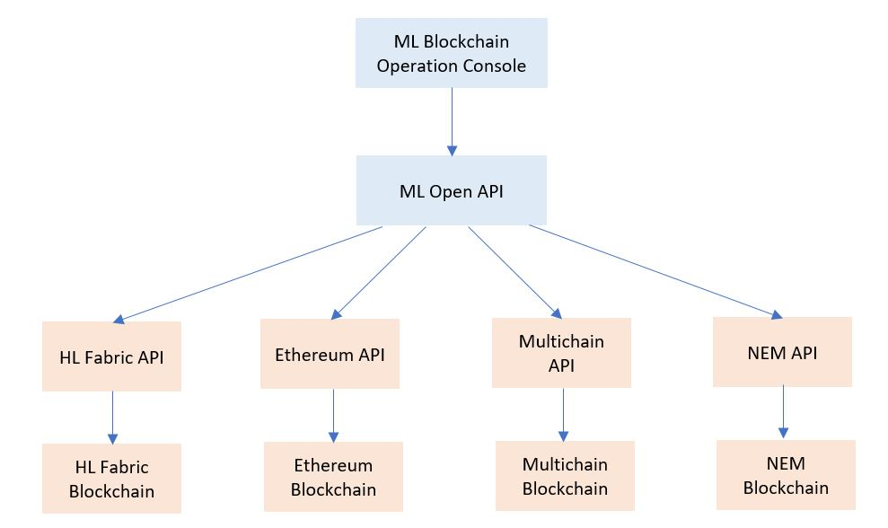

# Morpheus Labs

# BLOCKCHAIN OPERATION CONSOLE
The Operation Console aggregates the operational activities required to manage the Blockchain network provisioned on the platform. The operational activities include self-provisioning, health monitoring and membership management of Blockchain network. It will be used by organization admin, platform admin, auditors, and platform usets.

## Functional Principles
Provide access integration to:
  - Monitoring capabilities for Blockchain network that shows health status, block activities, log files, etc
  - Membership management capabilities of the Blockchain network
  - Self-provisioning capabilities for the Blockchain network nodes
  - Auditing capabilities of the Blockchain network
  
## Architecture Overview

  
## Blockchain Networks

The blockchain networks to be suppoted for first release of ML BPaaS are: Ethereum, HyperLedger Fabric, NEM and MultiChain.

## APIs and SDK of Blockchain Networks

The following APIs will be used by the Blockchain Operation Console.
### Ethereum

The JSON-RPC references: https://github.com/hyperledger/fabric-sdk-java

### HyperLedger Fabric

Java SDK references: https://github.com/hyperledger/fabric-sdk-java

### HyperLedger Composer

HyperLedger Composer API references: https://hyperledger.github.io/composer/latest/api/api-doc-index

### NEM

NEM API references: https://nemlibrary.com/documentation/architecture/

NEM Business Use Cases: https://nem.io/enterprise/use-cases/

### Multichain

MultiChain is compatible with any API library developed for Bitcoin Core. Multichain API references: https://www.multichain.com/developers/json-rpc-api/

## Blockchain Operation Console Functions

The blockchain Operation Console funcitons will be implemented in phases.

### Phase 1:

Explorer for HyperLedger Fabric, Ethereum, Nem and Multichain.

Operate for HyperLedger Fabric, Ethereum (test nodes), Nem (test nodes) and Multichain.

Provision of basic blockchain network for HyperLedger Fabric, Ethereum, Nem and Multichain.

### Phase 2:

Provision of more complex blockchain network for HyperLedger Fabric, Ethereum, Nem and Multichain.

### Phase 3:

Add more statistic charts for HyperLedger Fabric, Ethereum, Nem and Multichain (User Enhancement experiences)

